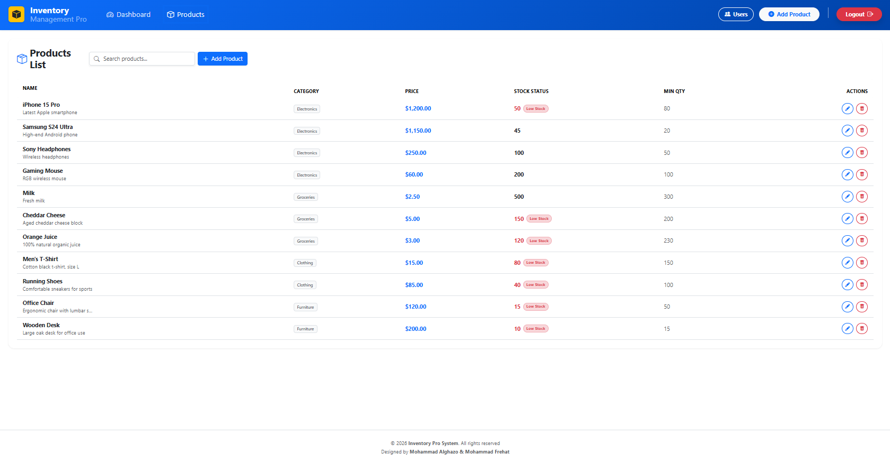

# 📦 Inventory Management System

A professional **Inventory Management System** built with **Angular 17** and **.NET 8**. Designed to streamline product tracking, stock management, and user permissions for businesses.

## 🚀 Key Features
- **📊 Interactive Dashboard:** Real-time insights, stock value analysis, and low-stock alerts.
- **📦 Product Management:** Easily Add, Edit, and Delete products with full details.
- **🔐 Secure Authentication:** Role-based access (Manager vs Employee) using JWT & BCrypt.
- **⚡ High Performance:** Built with the latest tech stack for speed and reliability.

## 🛠️ Tech Stack
- **Frontend:** Angular 17, Bootstrap 5
- **Backend:** ASP.NET Core Web API (.NET 8)
- **Database:** SQL Server

---

## 📸 Project Screenshots

### 1. Dashboard Overview
> Shows total products, total value, and critical low stock alerts.


### 2. Products Management
> A complete list of products with search and stock status capabilities.


### 3. Add New Product
> Simple interface to add new items to the inventory.


### 4. Login Screen
> Secure entry point for Managers and Employees.


---

## ⚙️ How to Run
1. **Backend:** Update `appsettings.json` with your SQL connection string and run the .NET API.
2. **Frontend:** Navigate to the frontend folder and run:
   ```bash
   ng serve -o

## Enjoy: Access the system at http://localhost:4200
## Developed by Mohammad Alghazo & Mohammad Frehat